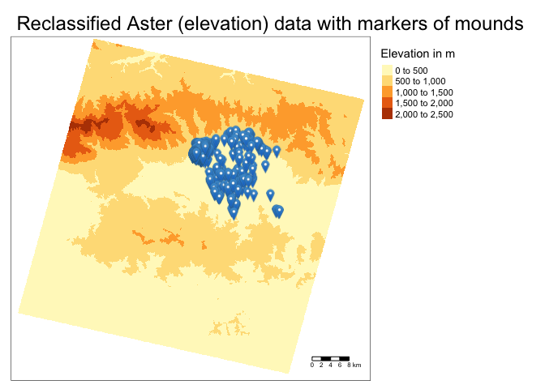
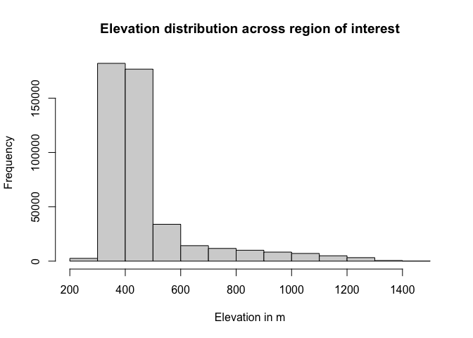
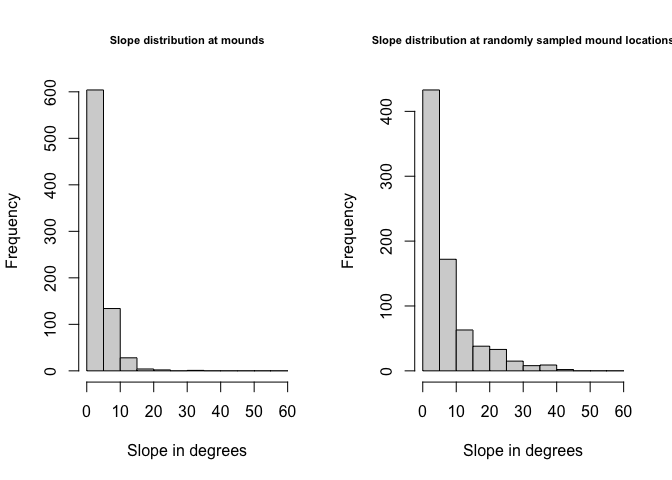
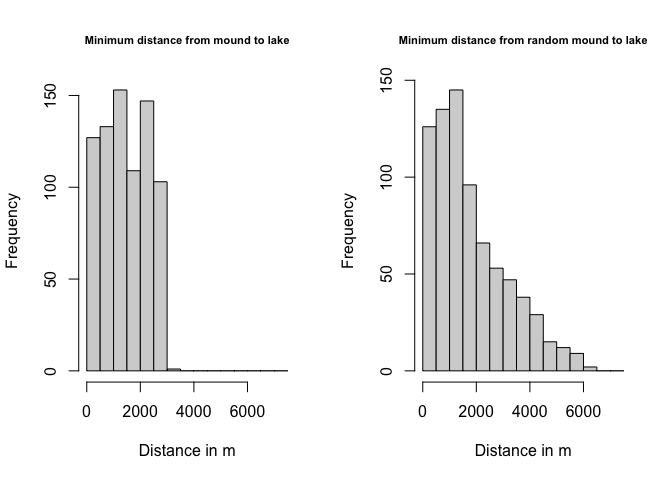

Week 5 Homework
================
Nicole Dwenger
3/5/2021

# Kazanlak Valley Analysis

## Cultural Heritage Assessment with DEM and Satellite Image data

In this exercise, you develop your own analysis, extracting values from
and working with ASTER or IKONOS imagery and a variety of modern and
archaeological data for the Kazanlak Valley in Bulgaria. Choose ONE of
the tasks below and delete the other. Review the available datasets, and
read the information in the relevant section as a jumping-off point.
Create a simple end to illustrate your results (if relevant). The two
possibilities for analysis are:

1.  evaluate the impact of anthropic factors on the burial mound health,
    or
2.  analyze formally the location preferences of the ancient mound
    builders
3.  practice unsupervised and supervised classification in R

Burial mounds are ubiquitous in the Bulgarian landscape, and the golden
treasures discovered in the Kazanlak Valley mounds have earned this
intramontane area the nickname “The Valley of the Thracian Kings”. The
present dataset includes over 700 mounds documented during intensive
pedestrian survey within the Kazanlak Valley and extended through the
remote sensing of the additional 150 sq km of IKONOS imagery. The mounds
range in height from 0.2m to \~20m, and in diameter from 15 to 100m.
Their contents represent a cross-section of the ancient society,
producing a fairly representative sample of ancient mortuary behavior.

## Task 2: Where in the landscape are the mounds located?

The location of settlements is usually easy to predict as humans need
safety and easy access to water and food resources. These range from
nearby arable soil to pasturage to trading centers. Choices regarding
the mortuary realm are much harder to establish as they are guided by
the social norms of the living rather than the natural environment. Some
environmental conditions, however, play a role, such as intervisibility,
which can be an important factor for societies that use monuments to the
dead for territorial signalling. Before such specific analysis, it is,
however, a good idea to get a general sense of where in the landscape
are mounds located.

In order to produce a formal assessment of mound location, you can start
by using most common aspects of topography, such as elevation, slope,
aspect, and water proximity. Choose one or more of these variables.
Calculate the distribution of classes of each environmental variable
through the entire region (defining, en route, what you consider to be a
“region”?) by extracting values from the digital elevation model and
binning them in several classes. Then, calculate site frequencies within
classes of the environmental variable by sampling mound locations in the
raster and evaluate whether the observed pattern could be a product of
the distribution of environmental categories themselves.

A example workflow with elevations could look like this:

  - extract elevation values from the entire landscape and bin them in
    elevation categories (e.g. 400-500m, 500-600m, 600-700m, etc.).
    Consider: what defines a landscape for the purpose of this study?
    You may wish to crop the Aster to a smaller but representative study
    area but make sure you justify your selection
  - extract elevation values from observed mound locations and review
    their distribution in the same bins
  - calculate the expected number of mounds per bin if mounds were
    located through the landscape randomly
  - compare the expected number with the observed one

## Description of Solution

For this task, I assessed the location of mounds by looking at (1)
elevation, (2) slope and (3) distance to lakes. This assessment was done
by only considering the area in which the mounds were located, while
adding a 1km buffer (visualisation of this below). For each of the three
variables, I extracted the data for the locations of the mounds and
compared them to randomly sampled locations in the region. More
specifically, the frequency distributions are compared, to assess
whether the distribution of the mound-values is just a product of the
distribution of the environmental categories, or whether there seems to
be a difference between randomly sampled locations and mounds. In the
following, I relied on the aster data, the mound data and the lake data.
More detailed descriptions can be found in connection with the code, and
a conclusion is also included after of the variables was analysed.

### Loading Libraries

``` r
# load libraries 
library(tidyverse)

library(raster)
library(sf)
library(tmap)

library(landsat)
library(lattice)
library(latticeExtra)
library(RColorBrewer)
library(rasterVis)
library(rgdal)
library(rgl)
```

### Loading Data

``` r
# load data 
# vector data
# shapefile of mounds (coordinantes)
mounds <- st_read("data/KAZ_mounds.shp")
# data about lakes
lakes <- st_read("data/kaz_lakes.shp")

# raster data
# raster data of elevation in area
aster <- raster("data/Aster.tif")
```

### Cleaning Data and Defining Region of Interest

In the process of cleaning and merging data I first made sure that the
crs were aligned across datasets, and then focused on cleaning the aster
data. This data included negative values, so I reclassified values
between -1 and -1000 to be NA, and then cropped the data to a relevant
region of interest. This region of interest was defined to be a polygon
containing the locations of the mounds, with a 1km buffer. The reason
for this simply being that we are interested in how the mounds are
located in the landscape. The process of reclassification and cropping
is visualised below.

``` r
# checking crs: all are WGS84, UTM 35N
st_crs(mounds) 
st_crs(lakes)
crs(aster)
```

``` r
# vector data cleaning
# merging mounds and mounds info into a common dataframe and turning it into sf object again
# mounds <- left_join(mounds_info, mounds_shape, by = c("MoundID" = "TRAP_Code")) %>% st_as_sf()

# aster data cleaning
# plotting to see what it looks like
tm_shape(aster) +
  tm_raster(title = "Elevation in m") +
  tm_shape(mounds) +
  tm_markers(size = 0.2) +
  tm_scale_bar(width = 0.1) +
  tm_layout(main.title = "Original Aster (elevation) data with markers of mounds",
            legend.outside = T)
```

    ## stars object downsampled to 1022 by 979 cells. See tm_shape manual (argument raster.downsample)

    ## Variable(s) "NA" contains positive and negative values, so midpoint is set to 0. Set midpoint = NA to show the full spectrum of the color palette.

<!-- -->

``` r
# reclassification: all values between -10000 and -1 become NA
reclass_matrix <- cbind(-10000,-1, NA)
reclassed_aster <- reclassify(aster, rcl = reclass_matrix)

# quick map: checking where the markers are in the raster file
tm_shape(reclassed_aster) +
  tm_raster(title = "Elevation in m") +
  tm_shape(mounds) +
  tm_markers(size = 0.2) +
  tm_scale_bar(width = 0.1) +
  tm_layout(main.title = "Reclassified Aster (elevation) data with markers of mounds",
            legend.outside = T)
```

    ## stars object downsampled to 1022 by 979 cells. See tm_shape manual (argument raster.downsample)

<!-- -->

``` r
# cropping aster based on the location of the mounds (with 1km buffer)
# this will be my landscape region, which I will look at in the following
cropped_aster <- crop(reclassed_aster, st_buffer(mounds, dist = 1000))

# plot again 
tm_shape(cropped_aster) +
  tm_raster(title = "Elevation in m") +
  tm_shape(mounds) +
  tm_markers(size = 0.2) +
  tm_scale_bar(width = 0.1) +
  tm_layout(main.title = "Cropped Aster (elevation) data with markers of mounds",
            legend.outside = T)
```

<!-- -->

``` r
# visualisation of the process: original, reclassified, cropped
#tmap_arrange(original, reclassed, cropped, nrow = 3, ncol = 1)
```

## Elevation Analysis

In a first step, I analysed the elevation. For this, I extracted the
elevation values at the coordinates of the mounds and I extracted the
same amount (773) of randomly sampled elevation values from the raster
(aster) data. Then, for both of these extracted datasets, I grouped
values into bins (breaks), and calculated their frequency, i.e. how many
elevation values are between 200-300, 300-400, … Further, I plotted the
distribution of elevation values beside each other to compare them.

``` r
# define breaks/bins
elevation_breaks <- c(200,300,400,500,600,700,800,900,1000,1100,1200,1300,1400,1500)

# get elevation data from entire defined region and put into bins to see the distribution
# not really relevant for the analysis, but kept it anyway
all_elevation_values <- values(cropped_aster)
# histogram
hist_all_elevation <- hist(all_elevation_values, 
                           breaks = elevation_breaks, 
                           xlab = "Elevation in m",
                           main = "Elevation distribution across region of interest")
```

<!-- -->

``` r
# put into bins and calculate frequency
df_all_elevation <- data.frame(table(cut(all_elevation_values, breaks = elevation_breaks, dig.lab = 5)))
df_all_elevation
```

    ##           Var1   Freq
    ## 1    (200,300]   2545
    ## 2    (300,400] 182038
    ## 3    (400,500] 176708
    ## 4    (500,600]  33915
    ## 5    (600,700]  14244
    ## 6    (700,800]  11699
    ## 7    (800,900]  10029
    ## 8   (900,1000]   8315
    ## 9  (1000,1100]   7082
    ## 10 (1100,1200]   4930
    ## 11 (1200,1300]   3216
    ## 12 (1300,1400]    565
    ## 13 (1400,1500]     15

``` r
# get elevation data only for the mounts 
mounds$elevation = raster::extract(cropped_aster, mounds)
# put into bins and calculate frequency
df_mounts_elevation <- data.frame(table(cut(mounds$elevation, breaks = elevation_breaks, dig.lab = 5)))
df_mounts_elevation
```

    ##           Var1 Freq
    ## 1    (200,300]    0
    ## 2    (300,400]  121
    ## 3    (400,500]  618
    ## 4    (500,600]   33
    ## 5    (600,700]    1
    ## 6    (700,800]    0
    ## 7    (800,900]    0
    ## 8   (900,1000]    0
    ## 9  (1000,1100]    0
    ## 10 (1100,1200]    0
    ## 11 (1200,1300]    0
    ## 12 (1300,1400]    0
    ## 13 (1400,1500]    0

``` r
# get elevation data for randomly sampled locations (same amount as we have mounds)
set.seed(1)
random_elevations <- sampleRandom(cropped_aster, 773)
# put into bins and calculate frequency
df_random_elevation <- data.frame(table(cut(random_elevations, breaks = elevation_breaks, dig.lab = 5)))
df_random_elevation
```

    ##           Var1 Freq
    ## 1    (200,300]    3
    ## 2    (300,400]  338
    ## 3    (400,500]  270
    ## 4    (500,600]   66
    ## 5    (600,700]   23
    ## 6    (700,800]   24
    ## 7    (800,900]   18
    ## 8   (900,1000]   13
    ## 9  (1000,1100]    8
    ## 10 (1100,1200]    7
    ## 11 (1200,1300]    3
    ## 12 (1300,1400]    0
    ## 13 (1400,1500]    0

``` r
# define to plot two plots next to each other
par(mfrow=c(1,2))

# histogram for mound locations
hist(mounds$elevation, breaks = elevation_breaks, 
     xlab = "Elevation in m",
     main = "Elevation distribution at mounds",
     cex.main = 0.7)

# histogram for random locations
hist(random_elevations, breaks = elevation_breaks,
     xlab = "Elevation in m",
     main = "Elevation distribution at randomly sampled mound locations",
     cex.main = 0.7)
```

<!-- -->

**Conclusion**: A comparison of the two histograms seems to indicate,
that most of the mounds have elevation values between 400-500m, while
all mounds have elevation values between 300-700m. When compared to the
randomly sampled values, there are also quite a few values between
300-500m, but values also go up to 1300m. Thus, it might be that mounds
are limited in their elevation, and are not insanely high.

## Slope Analysis

Second, I analysed the slope. For this, I extracted the slope in degrees
from the raster (aster) data. Then, I again used the coordinates of the
mounds to get their slope values, and compared them to 733 randomly
samples slopes from the raster data. Again, for both of these extracted
datasets, I grouped values into bins (breaks), and calculated their
frequency. Further, I plotted the distribution of elevation values
beside each other to compare them.

``` r
# extract slope and aspect data from raster data
slope_aster <- terrain(cropped_aster, opt = "slope", unit = "degrees")
slope_aster # min value of 0, 58 is max
```

``` r
# define breaks/bins
slope_breaks <- c(0,5,10,15,20,25,30,35,40,45,50,55,60)

# get slope data only for the mounts 
mounds$slope = raster::extract(slope_aster, mounds)
# put into bins and calculate frequency
df_mounts_slope <- data.frame(table(cut(mounds$slope, breaks = slope_breaks, dig.lab = 5)))
df_mounts_slope
```

    ##       Var1 Freq
    ## 1    (0,5]  604
    ## 2   (5,10]  134
    ## 3  (10,15]   28
    ## 4  (15,20]    4
    ## 5  (20,25]    2
    ## 6  (25,30]    0
    ## 7  (30,35]    1
    ## 8  (35,40]    0
    ## 9  (40,45]    0
    ## 10 (45,50]    0
    ## 11 (50,55]    0
    ## 12 (55,60]    0

``` r
# get slope data for randomly samples locations
set.seed(1)
random_slopes <- sampleRandom(slope_aster, 773)
# put into bins and calculate frequency
df_random_slopes <- data.frame(table(cut(random_slopes, breaks = slope_breaks, dig.lab = 5)))
df_random_slopes
```

    ##       Var1 Freq
    ## 1    (0,5]  433
    ## 2   (5,10]  172
    ## 3  (10,15]   63
    ## 4  (15,20]   38
    ## 5  (20,25]   33
    ## 6  (25,30]   15
    ## 7  (30,35]    8
    ## 8  (35,40]    9
    ## 9  (40,45]    2
    ## 10 (45,50]    0
    ## 11 (50,55]    0
    ## 12 (55,60]    0

``` r
# define to plot two plots next to each other
par(mfrow=c(1,2))

# histogram for mound locations
hist(mounds$slope, breaks = slope_breaks, 
     xlab = "Slope in degrees",
     main = "Slope distribution at mounds",
     cex.main = 0.7)

# histogram for random locations
hist(random_slopes, breaks = slope_breaks,
     xlab = "Slope in degrees",
     main = "Slope distribution at randomly sampled mound locations",
     cex.main = 0.7)
```

<!-- -->

**Conclusion**: Comparison of the two histograms seem to indicate, in
line with the results of the elevation data, that the range of slope
values at the mounds is limited to mostly vary between 0 and 20 degrees,
while most values are between 0 and 5. For the randomly sampled values,
most values are also between 0 and 5 degrees, but some values also reach
higher values, up to 45 degrees. Again, this might suggest, that mounds
never really have slopes which are steeper than 20 degrees.

## Lake Proximity Analysis

Lastly, I tried looking at how closely mounds are located in relation to
lakes. For this, I did not use the other raster data that we could
download, but used the vector data of lakes, to calculate the minimum
distance between each mound and the lakes. Then, I samples 773
coordinates randomly within the region of interest, and again calculated
their minimum distance to a lake. For both, frequency values within bins
are calculated and visualised in histograms.

``` r
lake_breaks <- c(0,500,1000,1500,2000,2500,3000,3500,4000,4500,5000,5500,6000,6500,7000,7500)

# calculating the distance from each of the mounds to each of the lake-polygons
min_lake_dist <- st_distance(mounds, lakes) %>% apply(1, FUN = min)
# put into bins and calculate frequency
df_min_lake_dist <- data.frame(table(cut(min_lake_dist, breaks = lake_breaks, dig.lab = 5)))
df_min_lake_dist
```

    ##           Var1 Freq
    ## 1      (0,500]  117
    ## 2   (500,1000]  133
    ## 3  (1000,1500]  153
    ## 4  (1500,2000]  109
    ## 5  (2000,2500]  147
    ## 6  (2500,3000]  103
    ## 7  (3000,3500]    1
    ## 8  (3500,4000]    0
    ## 9  (4000,4500]    0
    ## 10 (4500,5000]    0
    ## 11 (5000,5500]    0
    ## 12 (5500,6000]    0
    ## 13 (6000,6500]    0
    ## 14 (6500,7000]    0
    ## 15 (7000,7500]    0

``` r
# creating a box to extract random coordinates from
grid <- st_make_grid(st_buffer(mounds, dist = 1000))
samples <- st_sample(grid, 773)
# randomly sample locations 
random_lake_dist <- st_distance(samples, st_geometry(lakes)) %>% apply(1, FUN=min)
df_min_random_dist <- data.frame(table(cut(random_lake_dist, breaks = lake_breaks, dig.lab = 5)))
df_min_random_dist
```

    ##           Var1 Freq
    ## 1      (0,500]   96
    ## 2   (500,1000]  135
    ## 3  (1000,1500]  145
    ## 4  (1500,2000]   96
    ## 5  (2000,2500]   66
    ## 6  (2500,3000]   53
    ## 7  (3000,3500]   47
    ## 8  (3500,4000]   38
    ## 9  (4000,4500]   29
    ## 10 (4500,5000]   15
    ## 11 (5000,5500]   12
    ## 12 (5500,6000]    9
    ## 13 (6000,6500]    2
    ## 14 (6500,7000]    0
    ## 15 (7000,7500]    0

``` r
par(mfrow=c(1,2))

# histogram for mound to lake distance
hist(min_lake_dist, breaks = lake_breaks, 
     xlab = "Distance in m",
     main = "Minimum distance from mound to lake",
    cex.main = 0.7)

# histogram for distance from random to lakes
hist(random_lake_dist, breaks = lake_breaks,
     xlab = "Distance in m",
     main = "Minimum distance from random mound to lake",
     cex.main = 0.7)
```

<!-- -->

**Conclusion**: If everything went right, these values seem to suggest
that there is quite a sharp cut-off point around 3000m (3km) for the
distance between a mound and the closest lake. In comparison to the
randomly samples locations, this is interesting, as here values go up to
6000m (6km). If my steps were right, then this could suggest that mounds
are usually located in close proximity (3km) to lakes.
